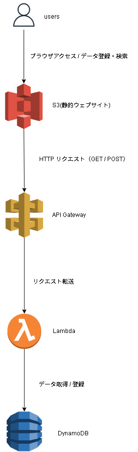

# serverless Infra - AWS Portfolio

**AWS上でhttp→APIGateway→lambda→DynamoDBを動作させる** リポジトリです

---

## 目次
- [概要](#概要)
- [設計ポイント](#設計ポイント)
- [使用技術](#使用技術)
- [構成図](#構成図)
- [セットアップ](#セットアップ)
- [Terraform認証構成](#Terraform認証構成)
- [ディレクトリ構成](#ディレクトリ構成)

---

## 概要
このプロジェクトでは以下を目的にAWS上でインフラを構築しています：
- APIを触ることを目的とする
- IaC（Infrastructure as Code）で再現可能な環境構築

---

## 設計ポイント
- WebサイトからGET・POSTリクエストを使ってAPIにアクセスし、Lambda関数を起動してDynamoDBにデータを登録・取得する構成

---


## 使用技術
- **AWS**
- **Terraform**
- **Git / GitHub**

---

## 構成図



---

## セットアップ
### 事前準備
- AWS アカウント
- AWS CLIインストール
- Terraformインストール

---

## Terraform認証構成
- IAMユーザーを作成し、以下を付与
  - sts:AssumeRole（terraform-bootstrap ロール引受用）
  - IAM管理権限（bootstrap時のみ）
- アクセスキーを作成

- AWS CLI プロファイル設定
  - base: アクセスキー設定
  - s3-api-lambda:
    - role_arn = terraform-bootstrap ロール
    - source_profile = base

- bootstrap実行後はIAM作成権限の削除を推奨

---

## 作業用ディレクトリで実施
### 初期化
terraform init

### 確認
terraform plan

### デプロイ
terraform apply

---

# ディレクトリ構成
```
S3-api-Lambda/
├─ README.md
├─ .gitignore                             # Gitの除外リスト
│
├─ docs/                                  # ドキュメントフォルダ
│  ├─ index.html                          # S3にアップ済みのHTMLのコピー
│  ├─ app.py                              # Lambda用Pythonコードのコピー
│  └─ architecture.png                    # 構成図
│
├─ dev/                                   # ルートモジュール
│   ├─ .terraform.lock.hcl                # プロバイダー固定ファイル
│   ├─ app.zip                            # Lambdaに渡すためのzip
│   ├─ main.tf                            # リソース作成用
│   ├─ providers.tf                       # プロバイダー定義用
│   ├─ terraformtfvars.example            # 変数使用例
│   └─ variables.tf                       # 変数用
│
├─modules/                                # modules
│    ├─ s3/                               # s3モジュール
│    │  ├─ main.tf                        # リソース作成用
│    │  ├─ output.tf                      # リソースアウトプット用
│    │  └─ variables.tf                   # 変数用
│    │
│    ├─ lambda/                           # lambdaモジュール
│    │  ├─ main.tf                        # リソース作成用
│    │  ├─ output.tf                      # リソースアウトプット用
│    │  └─ variables.tf                   # 変数用
│    │
│    ├─ api/                              # apiモジュール
│    │  ├─ main.tf                        # リソース作成用
│    │  ├─ output.tf                      # リソースアウトプット用
│    │  └─ variables.tf                   # 変数用
│    │
│    ├─ dynamodb/                         # DynamoDBモジュール
│    │  ├─ main.tf                        # リソース作成用
│    │  └─ variables.tf                   # 変数用
│    │
│    └─ iam_lambda/                       # lamubdaロールモジュール
│       ├─ main.tf                        # リソース作成用
│       ├─ output.tf                      # リソースアウトプット用
│       └─ variables.tf                   # 変数用
│
└─ terraform-bootstrap/                         # 初回のみ実行するTerraform用IAMロール作成用（作業用ディレクトリ）
             ├─ .gitignore                      # Git の除外リスト
             ├─ .terraform.lock.hcl             # プロバイダー固定ファイル
             ├─ attachment.tf                   # ポリシーをロールにアタッチ用
             ├─ locals.tf                       # ローカル変数
             ├─ policy_terraform.tf             # ポリシー 作成用
             ├─ provider.tf                     # プロバイダー定義用
             ├─ role.tf                         # ロール 作成用
             ├─ terraform.tfvars.example        # 変数設定例
             └─ variables.tf                    # 変数用
```
